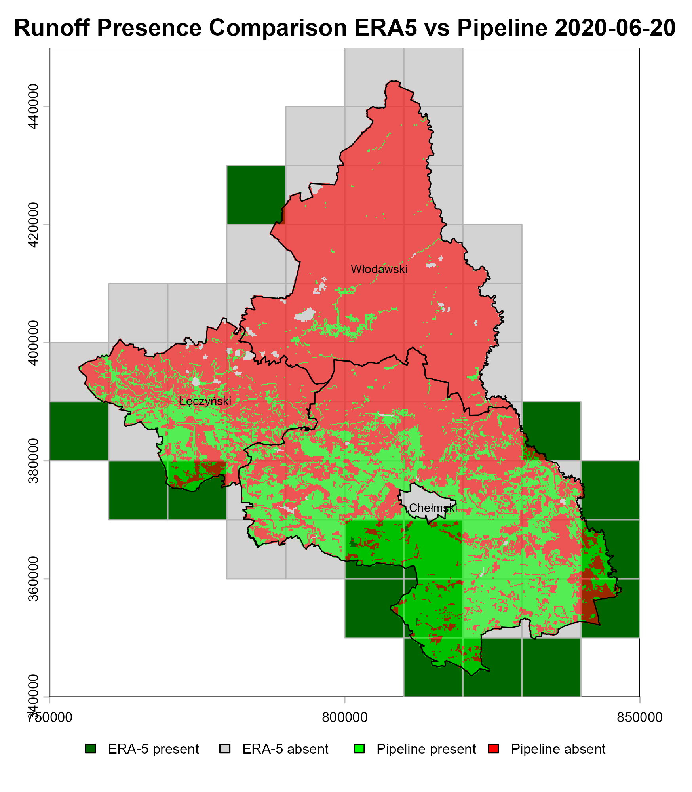
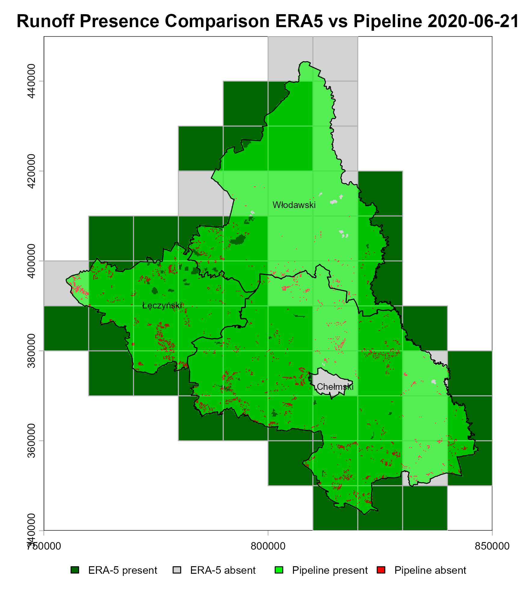
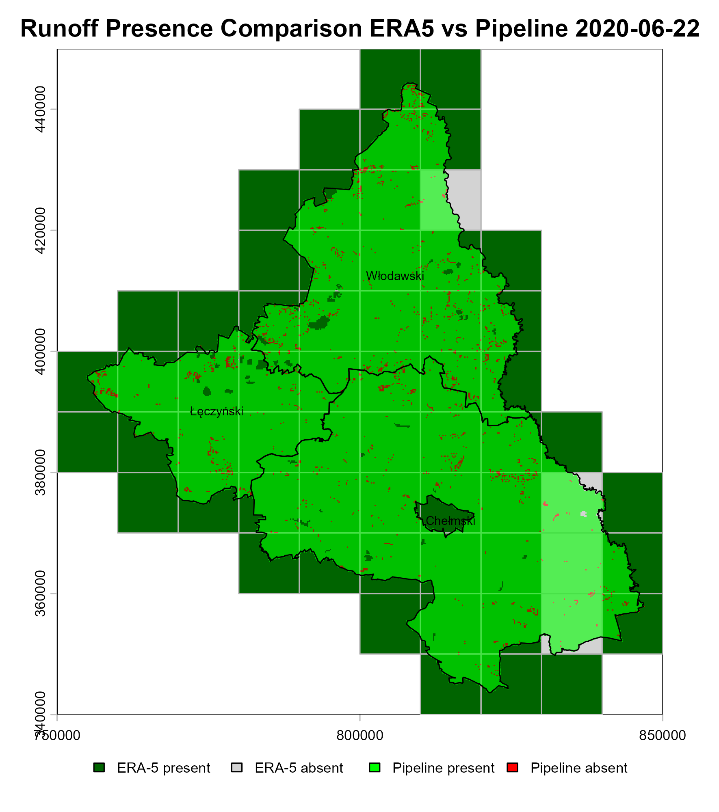
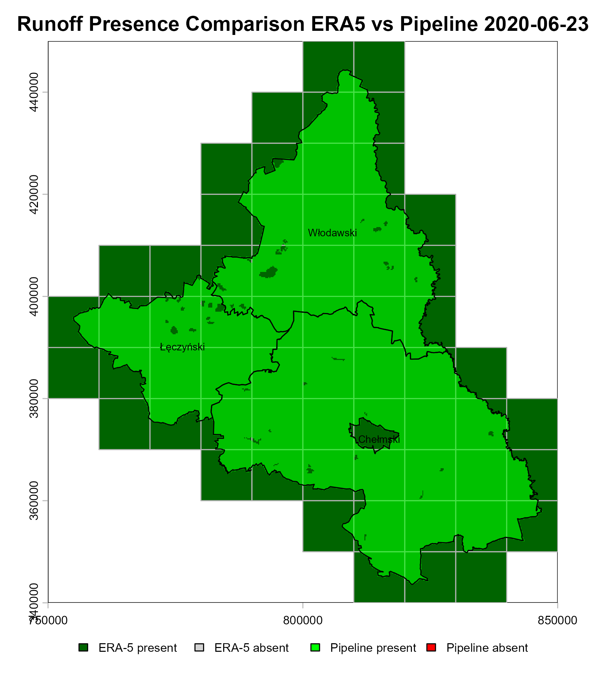
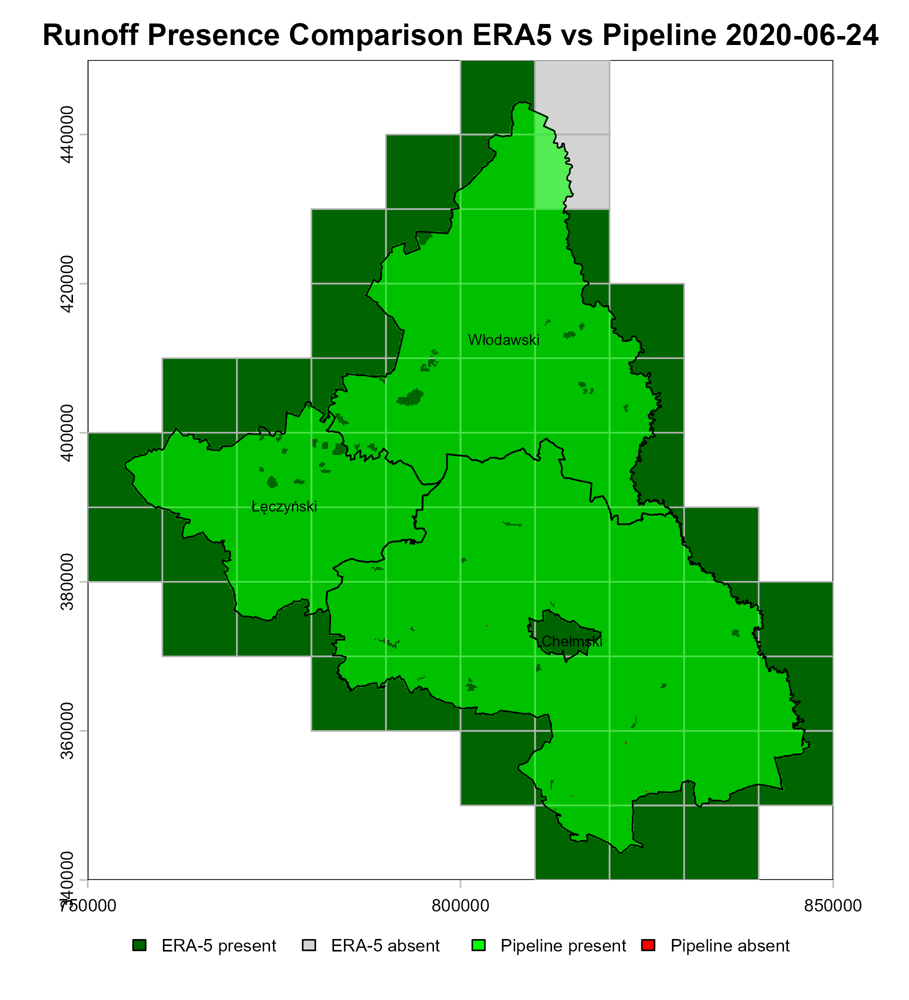
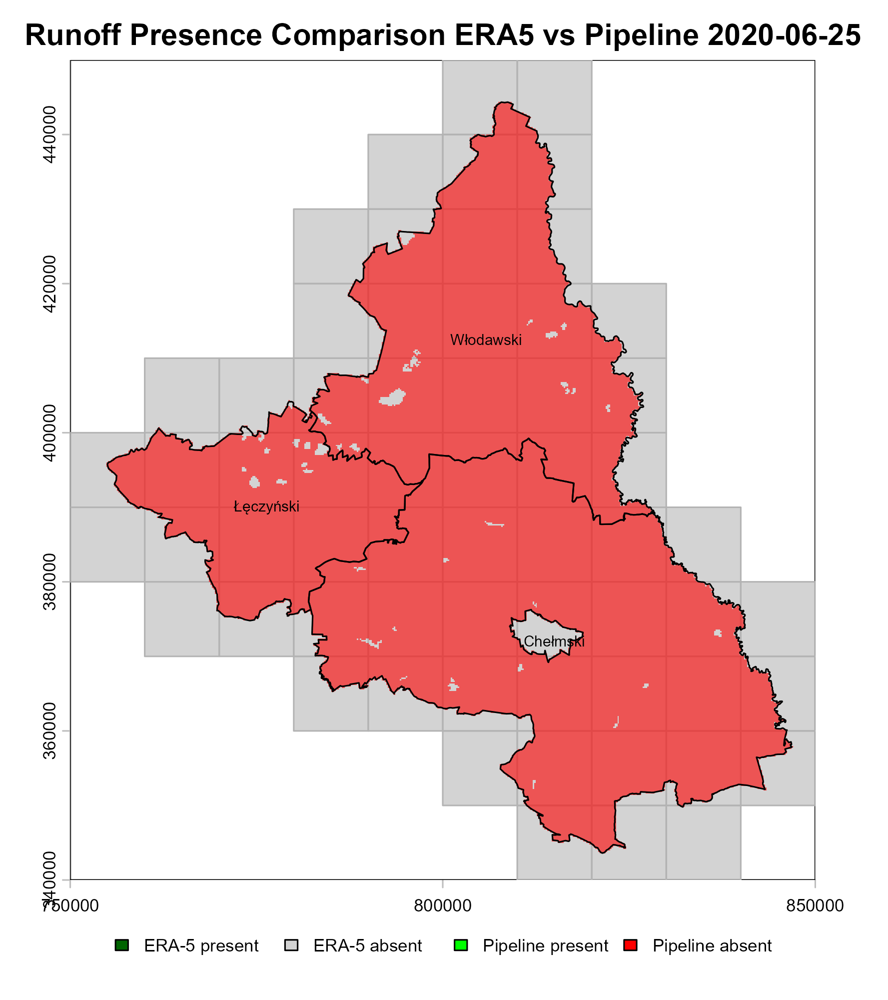
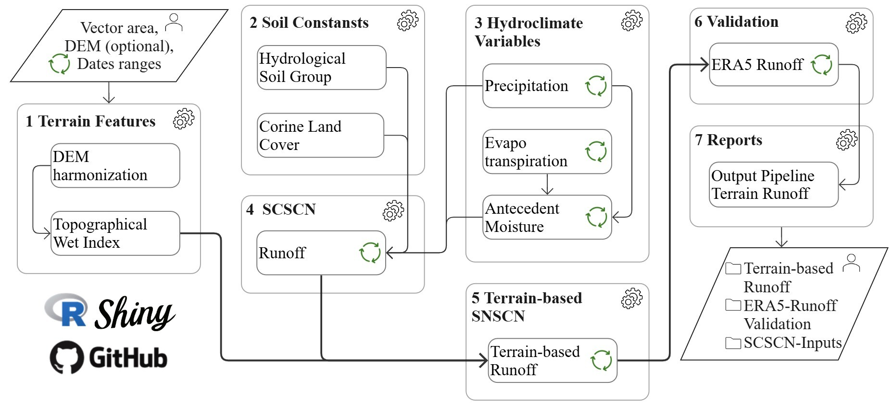

<h3>Welcome to Poland’s First Open-Source Automated Terrain-Based Runoff Modeling Pipeline!</h3>
Built-in the AGH University of Science and Technology of Kraków 

💌 yyara@agh.edu.pl  

<h3>🚀 New Update</h3>
Version 4 of the pipeline is now available!   
⚡<strong>New user-defined DEM input:</strong> The pipeline now supports an additional user parameter allowing users to upload a custom Digital Elevation Model (DEM) for any area within Poland, enabling higher-resolution and more site-specific terrain-based runoff simulations.  
⚡<strong>Multi-temporal terrain change assessment:</strong> Since the pipeline distributes runoff according to terrain-driven gravitational flow, users can run simulations using multiple DEMs from different time periods to assess how topographic changes caused by subsidence influence runoff pathways, accumulation zones, and flood-prone areas.  
⚡<strong>Interactive web-based user interface:</strong> The pipeline is now available through a dedicated web application at <a href="https://ynryara.shinyapps.io/terrain_runoff_pipeline/" target="_blank">Terrain Runoff Pipeline Web App</a>, providing an intuitive UI that allows users to configure simulation parameters, upload custom spatial inputs (vector shapefiles and DEMs), visualize runoff rasters interactively, and download processed outputs without requiring direct interaction with the source code.  

⚡<strong>Validation framework:</strong> Comparison between SCS-CN runoff estimates and ERA5-derived runoff presence.    
⚡<strong>New explanatory variables incorporated:</strong>  🆕 Hydrological Soil Groups (HSG) 🆕 CORINE Land Cover.    
⚡<strong>Antecedent Moisture Condition (AMC): </strong> Calculation as a proxy for spatio-temporal soil moisture variability in runoff estimation.    
⚡<strong>Terrain features:</strong> 🆕 Topographic Wetness Index (TWI) 🆕 Terrain-based Runoff.    
⚡<strong>Updated pipeline resolution and coverage:</strong> 
   - Spatial resolution: 200 m pixel size.   
   - Spatial extent: Entire Poland (380 powiats) + user-defined vector areas.   
   - Temporal coverage: Daily time series from 1 January 1960 to one week before the current date.   

⚡<strong>Pipeline refactoring:</strong> 
   - Improved modular structure.   
   - Enhanced scalability and usability.    
   - More reproducible and standardized functions.   
   - Optimized processing workflow.   
   - Pipeline architecture <a href="https://github.com/ynryara/terrain_runoff_pipeline/blob/main/docs/architecture.md" target="_blank">here</a>     

🚀 This version significantly strengthens the physical consistency, reproducibility, and operational capacity of the runoff modeling framework.

<h3>Introduction</h3>

Based on user-defined parameters, such as a specific date range and a region (either by powiat name or a custom shapefile), this R-based framework produces terrain-driven runoff estimates using the SCS-CN methodology. The system integrates topographic features, hydrological soil groups, CORINE land cover, and antecedent moisture conditions to ensure physically consistent outcomes. Runoff outputs are systematically validated against ERA5-based runoff presence, strengthening the scientific robustness of the framework. Designed with modularity, scalability, and reproducibility in mind, this pipeline supports applications in hydrology, climate research, environmental monitoring, hazard assessment, and data-driven modeling. 

📢 An article based on this repository will be submitted to a peer-reviewed, indexed scientific journal. Stay tuned for updates! 

<h3>Key Features of the Repository</h3>
✔ Daily hydroclimatic runoff raster data for Poland at county (powiat) level. 
✔ Variables: DEM, Topographic Wet Index, Corine Land Cover, Hydrological Soil Group, Evapotranspiration, Precipitation, Antecedent Moisture, Superficial Runoff (Table 1).  
✔ Functions: Automated Data Acquisition, Terrain & Environmental Characterization, Advanced Geospatial Processing, Hydrological Modeling (SCS-CN), Cloud-Native Integration, Statistics Validation Suite, and Optimized Pipeline Architecture.  
✔ User inputs: start date, end date, region, DEM. 
✔ Outputs: GeoTIFF time series rasters of the pipeline variables, ready for GIS (Image 1). 
✔ Built in R, modular and open-source.  

Table 1. Features of the pipeline variables.
| Pipeline Variable | Units | Source | Data Type | Temporal Window | Spatial Resolution | Pipeline Functions |
| --- | --- | --- | --- | --- | --- | --- |
| **DEM** | m | European Space Agency (2024) | Static | - | 200 m *| `environment_settings()`, `clipping()`, `dem_validation()` |
| **Topographic Wetness Index** | Dimensionless | Pipeline derivated | Static | - | 200 m | `topo_wet_index()` |
| **Land Cover** | Class ID (CLC) | Copernicus CLMS (2018) | Static | - | 200 m * | `environment_settings()`, `clipping()` |
| **Hydrological Soil Group** | Class (A-D) | Simons, et al (2020) | Static | - | 200 m | `environment_settings()`, `clipping()` |
| **Evapotranspiration** | mm/d | EUMETSAT (2025) | Dynamic | Daily | 200 m * | `fetch_evapotranspiration()`, `dimension_reduction()`, `harmonization()` |
| **Precipitation** | mm/d | Czernecki, et al (2020) | Dynamic | Daily | 200 m * | `fetch_precipitation()`, `interpolate_surface()`, `harmonization()` |
| **Antecedent Moisture** | mm | Pipeline derivated | Dynamic | Daily | 200 m | `antecedent_moisture_condition()` |
| **Pipeline Runoff** | mm/d | Pipeline derivated (SCS-CN) | Dynamic | Daily | 200 m | `runoff_estimation()`, `runoff_terrain()` |
| **Runoff for validation** | mm/d | ECMWF (ERA5-Land) | Dynamic | Daily | 10 km * | `era5_runoff()`, `validation_runoff()`, `validation_statistics()` |

** Resampled/Interpolated to match pipeline resolution.*  

<h3>How to Use This Repository</h3>
Follow these steps to generate high-resolution daily rasters of precipitation, evapotranspiration, and runoff for any powiat in Poland. 
 
1️⃣ Clone the Repository 
Open a terminal and run:  

<pre>git clone https://github.com/ynramirezy/hydroclimate-pipeline.git
cd hydroclimate-pipeline</pre>

2️⃣ Open the Main Script 
Open the file hydroclimate-pipeline.R in RStudio or your preferred R environment and customize your inputs. This script is your entry point to the pipeline: 

<pre>r

#Welcome to the Hydroclimate Data Pipeline for Runoff!
#This tool generates runoff rasters based on terrain features and SCS-CN methodology

# Please set the following parameters before running:
start_date <- as.Date("2020-06-15")
end_date <- as.Date("2020-06-25")

# Set the powiaty name or the shapefile path
pipeline_polygon <- c("Łęczyński", "Chełmski", "Włodawski")
#pipeline_polygon <- "../user_polygon.shp"

# Set your own DEM path (optional)
#user_DEM <- "../user_DEM.tif"
   
#And load the pipeline modules and functions
source("pipeline/global.R")

#Then, run the functions and wait while the results are generated!
runoff()
validation()
 </pre>
⚠️ Important!! Every time you modify the input parameters (start_date, end_date, or powiat_name), you must reload the global.R file. 

3️⃣ Pipeline Output 

| 2020-06-20 | 2020-06-21 | 2020-06-22 | 2020-06-23 | 2020-06-24 | 2020-06-25 |
| --- | --- | --- | --- | --- | --- |
|  |  |  |  |  |  |

---
Image 1. Output sample of the validation runoff pipeline repository data for the Łęczyński, Chełmski, and Włodawski counties for the date ranges 2020-06-20 to 2020-06-25. 

When visualizing the validation maps, the spatial overlap between the model and the reference data is represented as follows:

* **Grey Zones:** Areas where **ERA5-Land** does not detect runoff (Background/Baseline).
* **Dark Green Zones:** Areas where **ERA5-Land** confirms the presence of runoff.
* **Red Points/Areas:** **Pipeline (SCS-CN)** estimates where no runoff was expected by the reference (Potential false alarms or localized detections).
* **Green Points/Areas:** **Pipeline (SCS-CN)** estimates that correctly coincide with the presence of runoff in the reference data (Hits).

After processing the time series for the selected Powiats, the framework evaluates the spatial consistency between the terrain-based model and the global reference:

<pre>r
   
Daily performance metrics for the Terrain-based Runoff Pipeline
-------------------------------------
   Date     Accuracy   RMSE    Bias  
---------- ---------- ------- -------
 20200620    0.719     0.408   0.09  
 20200621    0.685     0.531   0.254 
 20200622    0.905     0.257   0.033 
 20200623      1         0       0   
 20200624    0.968     0.18    0.032 
 20200625      1         0       0   
-------------------------------------

🎯 The overall accuracy of the Terrain-based Runoff presence is: 87.95%
📈 Validation Diagnostic: +3.3% accuracy improvement over classic SCS-CN.
   
</pre>

This high accuracy level indicates a strong spatial agreement in the detection of runoff events, confirming the reliability of the **SCS-CN** approach at a 200m resolution when compared to the **ERA5-Land** 10km baseline.

<h3>Pipeline Workflow</h3>

<h3>References</h3>
<ul>
  <li>Copernicus Land Monitoring Service. (2018). CORINE Land Cover (CLC) 2018. European Environment Agency. https://land.copernicus.eu/en/products/corine-land-cover/clc2018.</li>
  <li>Czernecki, B., Głogowski, A., & Nowosad, J. (2020). Climate: An R package to access free in-situ meteorological and hydrological datasets for environmental assessment. Sustainability, 12(1), 394. https://doi.org/10.3390/su12010394.</li>
  <li>European Centre for Medium-Range Weather Forecasts (ECMWF). (2026). ERA5-Land daily aggregated data from 1981 to present. Copernicus Climate Change Service (C3S) via Google Earth Engine. https://developers.google.com/earth-engine/datasets/catalog/ECMWF_ERA5_LAND_DAILY_AGGR.</li>
  <li>European Space Agency. (2024). Copernicus Global Digital Elevation Model. Distributed by OpenTopography. https://doi.org/10.5069/G9028PQB</li>
  <li>Simons, G. W. H., Koster, R., & Droogers, P. (2020). HiHydroSoil v2.0: A high resolution soil map of global hydraulic properties (FutureWater Report 213). FutureWater. https://www.futurewater.eu/projects/hihydrosoil-v2-0-global-maps-of-soil-hydraulic-properties-at-250m-resolution/.</li>
  <li>The European Organisation for Meteorological Satellites (EUMETSAT). (2026). Daily evapotranspiration MDMET. https://datalsasaf.lsasvcs.ipma.pt/PRODUCTS/MSG/MDMET/.</li>  
</ul>
