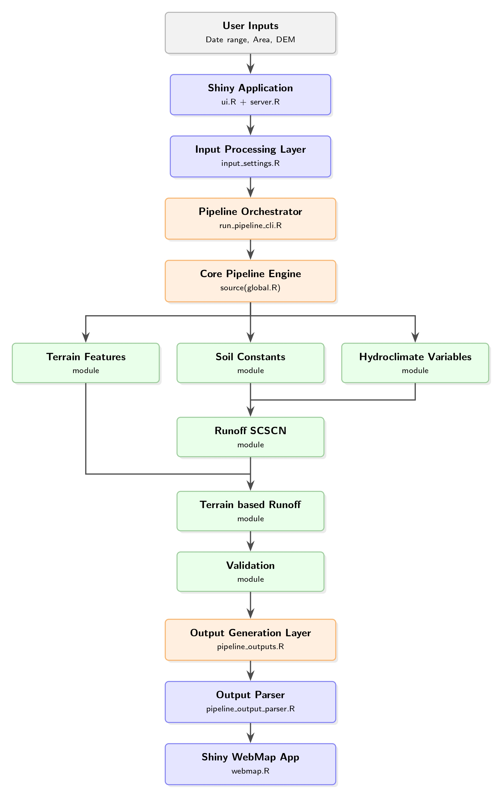

# Software Architecture

## Terrain-based SCS-CN Runoff Pipeline for Poland

### Overview

The **Terrain-based SCS-CN Runoff Pipeline for Poland** is an open-source geospatial framework developed in **R** for the automated generation of terrain-based runoff maps using the **Soil Conservation Service Curve Number (SCS-CN)** methodology. The project integrates digital terrain analysis, land cover information, soil properties, and hydroclimatic variables to produce high-resolution daily runoff estimations over the territory of Poland.

The software has been designed following a **modular architecture**, where the computational pipeline is completely independent from the graphical user interface (GUI). This design allows the core processing engine to be executed either manually, through the Shiny web application, or from the command line.

---

## High-level architecture

The project consists of three main layers:

1. **Presentation Layer (Shiny Application)**

   * Provides an interactive web interface.
   * Handles user inputs, map visualization, progress monitoring, and output download.
   * Delegates all computational tasks to the processing engine.

2. **Core Processing Pipeline**

   * Implements the complete terrain-based SCS-CN workflow.
   * Coordinates the execution of terrain analysis, hydroclimate data acquisition, runoff estimation, and validation modules.

3. **Supporting Resources**

   * Stores static GIS datasets, media resources, JavaScript utilities, and reproducible environment configuration.

---

## Project structure

```text
terrain_runoff_pipeline-main/
│
├── terrain_runoff_app.R            # Shiny application launcher
├── terrain_runoff_pipeline.R       # Manual pipeline launcher
│
├── app/                            # Shiny interface modules
│   ├── app_constants.R             # Global application constants
│   ├── app_setup.R                 # Environment initialization
│   ├── server.R                    # Main server logic
│   ├── ui.R                        # User interface definition
│   ├── helpers/                    # UI helper functions
│   ├── inputs/                     # Input observers and validation
│   └── map/                        # Interactive map functions
│
├── pipeline/                       # Core processing modules
│   ├── global.R                    # Pipeline environment loader
│   ├── run_pipeline_cli.R          # Command-line pipeline launcher
│   ├── assets/                     # Static GIS resources and media
│   ├── config/                     # Configuration and parameters
│   ├── functions/                  # Atomic processing functions
│   ├── main/                       # Main execution functions
│   └── modules/                    # High-level workflow modules
│
├── www/                            # CSS, JavaScript and images
├── renv/                           # Reproducible R environment
└── docs/                           # Project documentation
```

---

## Execution workflows

### 1. Interactive execution (Shiny)

The user launches the application through:

```r
source("terrain_runoff_app.R")
```

The application:

* Loads the reproducible R environment.
* Initializes the user interface.
* Validates the provided inputs.
* Invokes the pipeline through `run_pipeline_cli.R`.
* Displays generated raster outputs in an interactive Leaflet map.
* Packages and provides downloadable results.

---

### 2. Manual execution

Advanced users may execute the pipeline directly by editing:

```r
terrain_runoff_pipeline.R
```

This launcher allows users to specify:

* Start and end dates.
* Target powiat(s) or a custom polygon.
* Optional custom Digital Elevation Model (DEM).

The script then loads the pipeline environment and executes:

```r
runoff()
validation()
```

---

### 3. Command-line execution

The Shiny application internally calls:

```text
pipeline/run_pipeline_cli.R
```

This wrapper receives parameters using `commandArgs()`, initializes the pipeline variables, and executes the same processing workflow used by the manual launcher. This design guarantees that both execution modes share a single computational backend.

---

## Pipeline workflow

The core computational workflow can be summarized as follows:

 

## Core modules

### Terrain Features

Computes terrain-derived variables from the DEM, including:

* Slope.
* Flow accumulation.
* Topographic Wetness Index (TWI).
* Additional geomorphometric descriptors.

### Hydroclimate Variables

Retrieves and processes:

* Daily precipitation.
* Daily evapotranspiration.
* Antecedent moisture conditions.

### Soil Constants

Generates soil-related parameters required by the SCS-CN methodology using land cover and hydrological soil group information.

### SCS-CN Module

Implements the Soil Conservation Service Curve Number model to estimate effective runoff generation.

### Terrain-based Runoff Module

Combines terrain, hydroclimate, and soil variables to produce spatially distributed runoff rasters.

### Validation Module

Performs statistical evaluation and quality control of the generated outputs.

---

## Design principles

The software architecture follows several guiding principles:

* **Modularity:** each processing task is encapsulated in an independent function or module.
* **Separation of concerns:** the graphical interface and the computational engine are fully decoupled.
* **Reproducibility:** package versions are managed through `renv`.
* **Extensibility:** new modules or data sources can be integrated without modifying the existing interface.
* **Reusability:** the same computational pipeline supports manual, command-line, and web-based execution.

---

## Entry points

The project provides three independent entry points:

| File                          | Purpose                                                                     |
| ----------------------------- | --------------------------------------------------------------------------- |
| `terrain_runoff_app.R`        | Launches the Shiny web application.                                         |
| `terrain_runoff_pipeline.R`   | Executes the pipeline manually from RStudio.                                |
| `pipeline/run_pipeline_cli.R` | Executes the pipeline from the command line or through Shiny (`system2()`). |

---

## Configuration management

Project configuration is centralized in the `pipeline/config/` and `app/` directories:

* `app_constants.R`: application-wide constants and default values.
* `app_setup.R`: initialization of libraries and environment.
* `packages.R`: package loading and dependency management.
* `parameters.R`: pipeline default parameters.
* `settings.R`: global processing options.
* `utils.R`: shared utility functions.

This organization minimizes hard-coded values and facilitates long-term maintenance.

---

## Reproducibility and portability

The project uses the **renv** package to ensure a fully reproducible computational environment. All package versions are isolated within the project, allowing the pipeline to be executed consistently across different machines and operating systems.

---

## Future extensions

The modular architecture enables future integration of:

* Additional runoff estimation methods.
* Alternative hydroclimatic data providers.
* Machine learning-based runoff prediction modules.
* Cloud-native or containerized deployments.
* Parallel processing and distributed computation.

The current design provides a robust foundation for both operational hydrological analysis and future scientific development.
